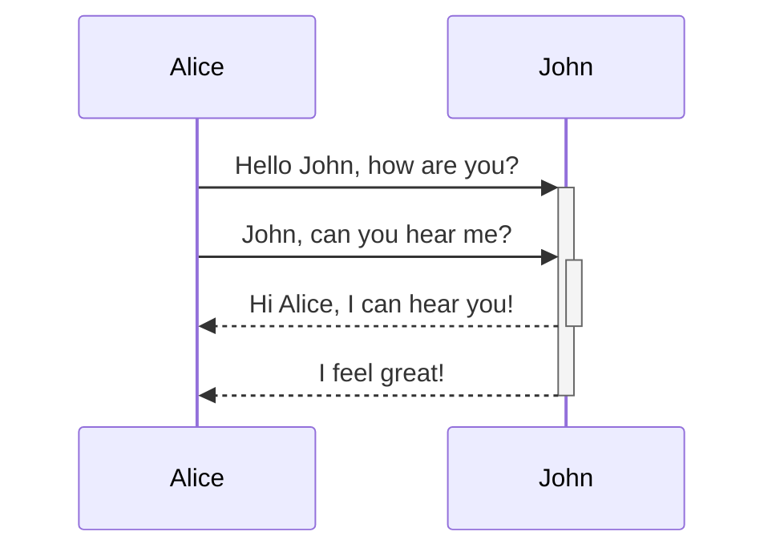
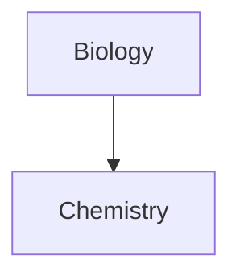

---
WHAT THE HECK:
  - WHAT THE HECK
  - OHHHH My God
  - AAAAAAAAAAAA
tags:
  - tagsExist
aliases:
  - guide
  - reference
  - hotkeys
cssclasses:
---
##### Properties
Use --- at the beginning of a file to add properties (allow you to organize info about a note using structured data). Properties are mainly useful for using with other plugins.

Here's a sample use case of properties
```
---
title: A New Hope # This is a text property
year: 1977
favorite: true
cast: # This is a list property
  - Mark Hamill
  - Harrison Ford
  - Carrie Fisher
---
```

This is useful for indexing with the property search. Note that properties can also be defined using JSON. Here are some links to get started: 
- https://help.obsidian.md/Editing+and+formatting/Properties
- https://help.obsidian.md/Editing+and+formatting/Basic+formatting+syntax

##### Tables
Create Table: `Ctrl + Alt + T`

##### Miscellaneous Hotkeys
Switch between Editing View and Reading: `Ctrl + E`
Open Quick Switcher to quickly search open notes using keyboard: `Ctrl + O`

##### Make Your Notes Cool as Heck
Obsidian Canvas exists for visual notetaking and connections
- https://obsidian.md/canvas#protips https://help.obsidian.md/Plugins/Canvas

Use HTML to style stuff: 

`<p style="color: red">USE IFRAMES TO EMBED WEB PAGES.</p>`
<p style="color: red">USE IFRAMES TO EMBED WEB PAGES.</p>
```
<iframe src="INSERT YOUR URL HERE"></iframe>
```
 
Above created using ``

Underline and strikethrough using HTML syntax `<u>Example</u>`: <u>Example</u> `<s>Strike OUT</s>` <s>Strike OUT</s> 

Honestly you can use HTML to <span style='font-family: "cursive"'>style anything in your notes</span> 

You can link to just a unit of text in a note using `#^`. Since these identifiers are usually random numbers, you can create more readable identifiers by using `^text` to label the block of text.

To reference a specific note using different names, add aliases.
```
---
aliases:
  - Doggo
  - Woofer
  - Yapper
---

# Dog
```

This would be useful in situations where your note is named 'Artificial Intelligence' but you just want to reference this note as 'AI'
##### Mermaid - 3rd Party
https://mermaid.js.org/#/


| *T*        |     |     |     |
| ---------- | --- | --- | --- |
| :Let it go |     |     |     |
|            |     |     |     |




##### MathJax and LaTeX
$$
\begin{vmatrix}a & b\\
c & d
\end{vmatrix}=ad-bc
$$
Double \$\$ for its own line, \$ for just inline
Quick Reference: https://math.meta.stackexchange.com/questions/5020/mathjax-basic-tutorial-and-quick-reference
https://docs.mathjax.org/en/latest/input/tex/extensions/index.html


Markdown:
https://github.github.com/gfm/

Inspiration for Sliding Notes feature
https://notes.andymatuschak.org/About_these_notes

---
tags:
- recipe
- cooking
--- 
#tagsExist

> [!tip]- Example Callout
> Basically use a > symbol
> and voila
> Use \[!tip] to create the title of the callout
> Add a + or - after the brackets of tip to make the callout foldable
> ![[ResonanceStructuresDrawing]]

Callout Types:
- [!note]
- [!abstract] (other alias are summary and tldr)
- [!info]
- [!todo]
- [!tip] (other alias are hint and important)
- [!success] (other alias are check and done)
- [!question] (aka help or faq)
- [!warning] (aka caution or attention)
- [!failure] (aka fail or missing)
- [!danger] (aka error)
- [!bug]
- [!example]
- [!quote] (aka cite)
	- there is a different way of quoting shown below:
	> Human beings face ever more complex and urgent problems, yada yada yada change the world
	\- Doug Engelbartender, 1961

Use a \> for cool highlight

### Modifying Theme and Appearance
```CSS
/* Creates a custom appearance for callout */
.callout[data-callout="custom-question-type"] {
    --callout-color: 0, 0, 0;
    --callout-icon: lucide-alert-circle;
    /* --callout-icon: '<svg>...custom svg...</svg>';*/
}
```
Icons come from https://lucide.dev/ or just use your own as shown above in the comment

Hold ALT and select another position in the note to have multiple cursors. You can use shift alt and drag to edit consecutive lines of text.


Bookmarks are for creating shortcuts to frequently visited items.

For when you have too many notes
https://help.obsidian.md/Plugins/Search

Learn RegEx
https://www.freecodecamp.org/news/practical-regex-guide-with-real-life-examples/
https://developer.mozilla.org/en-US/docs/Web/JavaScript/Guide/Regular_expressions

You can make slides out of your notes. Just make sure you separate where slides would be using ---. 

Creating templates
https://help.obsidian.md/Plugins/Templates

You have a web clipper extension. Learn how to use it here:
https://help.obsidian.md/web-clipper

